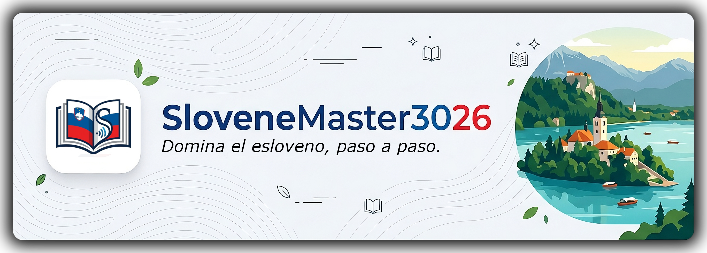
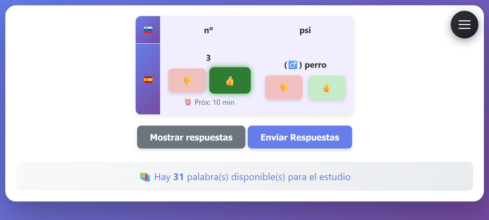
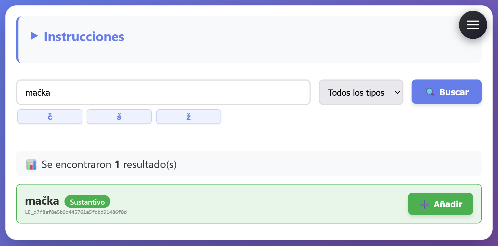
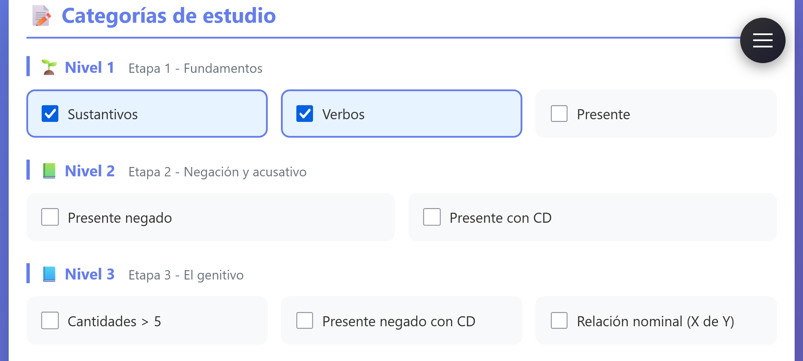

<p style="text-align: center;"></p>

<p style="text-align: center;">
  <strong>Una aplicación web inteligente de Repetición Espaciada (SRS) para dominar las declinaciones y la gramática del esloveno.</strong>
</p>

<p style="text-align: center;">
  
  
  
</p>

---

## 📖 Sobre el proyecto

<p style="text-align: center;">
  
  
  
  
  
  
</p>

**SloveneMaster3026** no es otra app de flashcards más. Es un sistema generativo donde el vocabulario que quieres estudiar se inserta dinámicamente en estructuras de frases reales, forzando la práctica de declinaciones, aspecto verbal y género en su contexto real. Todo ello regido por un algoritmo personalizado de **Repetición Espaciada (SRS)** para maximizar la retención invirtiendo el menor tiempo posible.

---

## ✨ Características Principales

* 🧠 **Algoritmo de Repetición Espaciada (SRS):** Maximiza tu tiempo de estudio. Si reconoces y conjugas correctamente un término, tardarás más en volver a verlo. Si fallas, reforzaremos ese concepto.
* 🧩 **Generación Dinámica de Frases:** El vocabulario que añades se inserta en estructuras de frases reales generadas dinámicamente, forzando la práctica de cada declinación en su contexto sintáctico correcto.
* 📝 **Variedad de Estructuras Gramaticales:** Practica los seis casos eslovenos (nominativo, genitivo, dativo, acusativo, locativo e instrumental) a través de distintos tipos de frases, cubriendo tanto sustantivos como verbos en diferentes contextos.
* 📚 **Integración Nativa con [Sloleks](https://viri.cjvt.si/sloleks/):** La app descarga y procesa automáticamente los datos morfológicos del lexicón oficial esloveno. No necesitas hacer nada manualmente.
* 🎨 **Ayudas Visuales Cognitivas:** Interfaz adaptada con colores e indicadores visuales inmediatos para reconocer el aspecto verbal o el género gramatical al instante.
* 📊 **Panel de Estadísticas Integral:** Registra cada respuesta y te ofrece una visualización detallada de tu progreso y rendimiento a lo largo del tiempo.
* 📱 **Interfaz Responsive:** Funciona en escritorio y móvil sin necesidad de instalar ninguna app nativa.
* 🐳 **Despliegue con Docker:** Listo para ejecutar en minutos gracias a la contenerización total; sin conflictos de dependencias.

---

## 📸 Galería

<details>
<summary><strong>Vista de estudio</strong></summary>

</details>
<details>
<summary><strong>Añadir palabras</strong></summary>

</details>
<details>
<summary><strong>Configuración</strong></summary>

</details>


---

## 🚀 Cómo Ejecutar la Aplicación

SloveneMaster3026 es una aplicación **monousuario** que se ejecuta localmente en tu máquina (o en la nube de forma gratuita vía GitHub Codespaces). No requiere instalación de Java ni configuración de bases de datos: Docker se encarga de todo.

Al arrancar por primera vez, la aplicación descarga automáticamente los datos de [Sloleks](https://viri.cjvt.si/sloleks/) y crea la base de datos local. No necesitas preparar nada antes.

---

### Opción A — Ejecutar localmente con Docker Desktop

**Requisitos:** tener [Docker Desktop](https://www.docker.com/products/docker-desktop/) instalado.

1. **Clona el repositorio:**
   ```bash
   git clone https://github.com/niedon/SloveneMaster3026.git
   cd SloveneMaster3026
   ```

2. **Arranca la aplicación:**
   ```bash
   docker-compose up -d --build
   ```

3. **Abre en tu navegador:** `http://localhost:8080`

*💡 **Comandos útiles:***
* Ver logs en tiempo real: `docker-compose logs -f`
* Detener la aplicación: `docker-compose stop`
* Eliminar los contenedores: `docker-compose down`

---

### Opción B — Sin instalar nada: GitHub Codespaces ☁️

GitHub Codespaces permite ejecutar la app directamente en el navegador, sin instalar Docker ni nada en tu máquina. Tiene un **nivel gratuito de 60 horas al mes**.

1. En la página del repositorio, pulsa el botón verde **`<> Code`** → pestaña **Codespaces** → **"Create codespace on master"**.
2. Espera a que el entorno arranque (puede tardar un minuto la primera vez).
3. Una vez dentro, ejecuta en la terminal del Codespace:
   ```bash
   docker-compose up -d --build
   ```
4. GitHub detectará automáticamente el puerto 8080 y te ofrecerá abrirlo en el navegador.

---

### Opción C — Imagen precompilada desde GHCR

Si solo quieres usar la aplicación sin clonar el repositorio, puedes descargar directamente la imagen publicada en el GitHub Container Registry:

```bash
docker run -p 8080:8080 ghcr.io/niedon/sloveneMaster3026:latest
```

Después abre `http://localhost:8080` en tu navegador.

> 💡 Puedes sustituir `latest` por cualquier versión de los [Releases](https://github.com/niedon/SloveneMaster3026/releases).

---

## 🗄️ Estructura de Datos

La aplicación gestiona automáticamente su almacenamiento. Los datos se organizan en dos directorios internos del contenedor, expuestos como volúmenes Docker:

| Directorio  | Contenido                                                                   |
|-------------|-----------------------------------------------------------------------------|
| `xml/`      | Ficheros XML de Sloleks, descargados automáticamente en el primer arranque. |
| `db/`       | Base de datos SQLite `esloveno.db`, creada y mantenida por la aplicación.   |

No es necesario interactuar con estos directorios para el uso normal. Están expuestos únicamente para facilitar el acceso directo a la base de datos o la inspección de los XML en caso de depuración.

La base de datos se encarga de:
- **Gestión SRS:** Historiales de repasos, variables algorítmicas y coeficientes de retención.
- **Lógica de elegibilidad:** Rastrea qué palabras pueden estudiarse en función de las frases activas y la información completada por el usuario.
- **Analíticas:** Registros de aciertos/errores para el panel de estadísticas.
- **Diccionario interno:** Datos morfológicos indexados desde los XML de Sloleks 3.0.

---

## ❓ Preguntas Frecuentes

<details>
<summary><strong>¿Tengo que descargar los datos de Sloleks manualmente?</strong></summary>

No. La aplicación los descarga e indexa automáticamente la primera vez que arranca. No necesitas hacer nada.
</details>

<details>
<summary><strong>¿Puedo añadir cualquier palabra del esloveno?</strong></summary>

Puedes añadir cualquier palabra que figure en Sloleks, que cubre un vocabulario muy amplio del esloveno estándar. La idea es que vayas incorporando palabras a medida que avances en tu aprendizaje, para entrenar sus declinaciones y conjugaciones según las vayas encontrando.
</details>

<details>
<summary><strong>¿Qué es una "palabra incompleta" y cuándo puedo estudiarla?</strong></summary>

Una palabra recién añadida está *incompleta* si aún le falta información necesaria para el estudio, como su traducción. Una vez la rellenas en la sección **Completar**, la palabra pasa a estar disponible, aunque solo podrás practicarla si tienes al menos una frase activa en la que encaje. Por ejemplo, no podrás practicar el acusativo de un sustantivo si no tienes ninguna frase activa que incluya complemento directo.
</details>

<details>
<summary><strong>¿Qué diferencia hay entre una frase "activa" y una "inactiva"?</strong></summary>

Las frases activas son las que has habilitado en la sección de **Configuración**. Solo las frases activas participan en la generación de ejercicios. Si desactivas una frase, las palabras que solo encajaban en ella dejarán de aparecer en las sesiones de estudio.
</details>

<details>
<summary><strong>¿Funciona en el móvil?</strong></summary>

Sí. La interfaz es completamente responsive y está pensada para usarse tanto en escritorio como en dispositivos móviles desde el navegador.
</details>

<details>
<summary><strong>¿Pierdo mi progreso si detengo o reinstalo Docker?</strong></summary>

No, siempre que no elimines el volumen de datos. La base de datos persiste entre reinicios del contenedor. Solo se perdería si ejecutas `docker-compose down -v` (que elimina los volúmenes explícitamente) o borras manualmente el directorio `db/`.
</details>

<details>
<summary><strong>¿Puedo estudiar verbos además de sustantivos?</strong></summary>

Sí. El sistema soporta tanto sustantivos (con sus declinaciones por caso y número) como verbos (con sus conjugaciones y aspecto verbal), siempre que existan frases activas que los contemplen.
</details>

<details>
<summary><strong>¿Funciona sin conexión a internet una vez instalada?</strong></summary>

Sí, salvo en el primer arranque, cuando la aplicación necesita descargar los datos de Sloleks. A partir de entonces funciona completamente en local sin necesidad de conexión.
</details>

<details>
<summary><strong>¿Cuántas palabras puedo tener en la aplicación?</strong></summary>

No hay un límite fijo. Puedes tener tantas palabras como quieras; el algoritmo SRS se encargará de distribuir la carga de repaso de forma eficiente para que no se acumulen.
</details>

---

## 🤝 Contribuir

¡Las contribuciones son muy bienvenidas! Si quieres corregir reglas gramaticales, mejorar la interfaz, o añadir nuevas estructuras de frases aprovechando la arquitectura modular del paquete `frases` (que define las estructuras mediante clases abstractas, permitiendo extender el motor con nuevos patrones sin tocar la lógica central):

1. Haz un *Fork* del proyecto.
2. Crea tu rama de característica (`git checkout -b feature/NuevaFraseEslovena`).
3. Haz un *Commit* de tus cambios (`git commit -m 'Añadida estructura de caso instrumental'`).
4. Sube la rama (`git push origin feature/NuevaFraseEslovena`).
5. Abre un *Pull Request*.

---

## 📄 Licencia

Distribuido bajo la Licencia **GNU Affero General Public License v3.0 (AGPLv3)**. Consulta el archivo `LICENSE` para más información.

Copyright (c) 2026 Basilio Cadaval Rodríguez